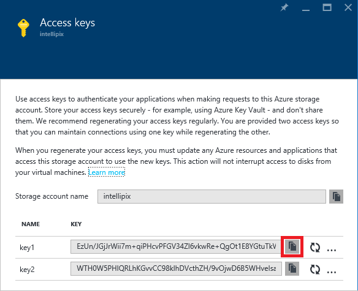
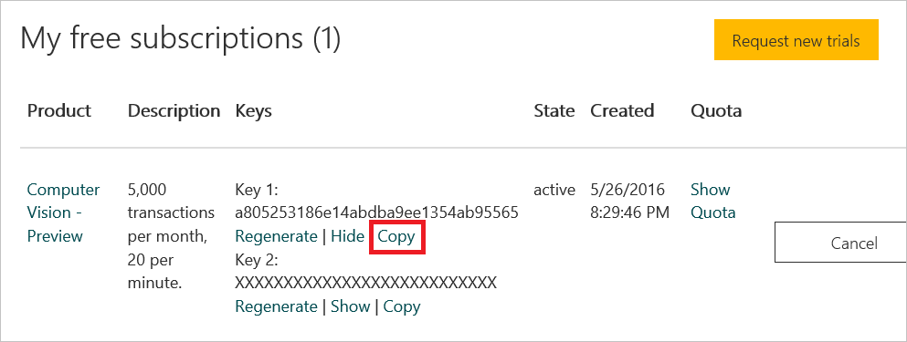

<a name="HOLTitle"></a>
# Azure Storage and Cognitive Services #

---

<a name="Overview"></a>
## Overview ##

Microsoft Azure Storage is a set of services that allows you to store large volumes of data in a cost-effective manner and in a way that makes the data readily and reliably available to services and applications that consume it. Data committed to Azure Storage can be stored in blobs, tables, queues, or files. [Azure blobs](http://azure.microsoft.com/en-us/services/storage/blobs/) are ideal for storing images, videos, and other types of data, and are frequently used to provide input to and capture output from other Azure services such as [Azure Stream Analytics](http://azure.microsoft.com/en-us/services/stream-analytics/). [Azure tables](http://azure.microsoft.com/en-us/services/storage/tables/) provide NoSQL storage for semi-structured data. [Azure queues](http://azure.microsoft.com/en-us/services/storage/queues/) support queued message transfers between applications (or parts of applications) and can be used to make applications more scalable and robust by loosely coupling them together. Finally, [Azure Files](http://azure.microsoft.com/en-us/services/storage/files) use the Server Message Block (SMB) protocol to share files through the cloud and access storage as network drives.

Data stored in Microsoft Azure Storage can be accessed over HTTP or HTTPS using straightforward REST APIs, or it can be accessed using rich client libraries available for many popular languages and platforms, including .NET, Java, Android, Node.js, PHP, Ruby, and Python. The [Azure Portal](https://portal.azure.com) includes features for working with Azure Storage, but richer functionality is available from third-party tools, many of which are free and some of which work cross-platform.

In this lab, you will write an app that accepts images uploaded by users and stores the images in Azure blob storage. You will learn how to read and write blobs in Node.js, and how to use blob metadata to attach additional information to the blobs you create. You will also get first-hand experience using [Microsoft Cognitive Services](https://www.microsoft.com/cognitive-services/), a set of intelligent APIs for building equally intelligent applications. Specifically, you'll submit each image uploaded by the user to Cognitive Services' [Computer Vision API](https://www.microsoft.com/cognitive-services/en-us/computer-vision-api) to generate a caption for the image as well as searchable metadata describing the contents of the image. Along the way, you'll discover how easy it is to deploy apps to the cloud using Git and Visual Studio Code.

<a name="Objectives"></a>
### Objectives ###

In this hands-on lab, you will learn how to:

- Create a storage account and containers using the Azure Portal
- Write a Node.js app in Visual Studio Code and deploy it to Azure using Git
- Read and write blobs and attach metadata to them
- Use the Computer Vision API to extract information from images
- Use the cross-platform [Microsoft Azure Storage Explorer](http://storageexplorer.com/) to work with Azure Storage

<a name="Prerequisites"></a>
### Prerequisites ###

The following are required to complete this hands-on lab:

- A Microsoft Azure subscription - [sign up for a free trial](http://aka.ms/WATK-FreeTrial)
- Visual Studio Code (provided for you in the lab VM)
- Git version 2.0 or higher (provided for you in the lab VM)
- Node.js version 4 or higher (provided for you in the lab VM)
- The Microsoft Azure Storage Explorer (provided for you in the lab VM)

---
<a name="Exercises"></a>
## Exercises ##

This hands-on lab includes the following exercises:

- [Exercise 1: Create a storage account](#Exercise1)
- [Exercise 2: Run the Microsoft Azure Storage Explorer](#Exercise2)
- [Exercise 3: Create a new project in Visual Studio Code](#Exercise3)
- [Exercise 4: Add a lightbox for viewing photos](#Exercise4)
- [Exercise 5: Use Cognitive Services to generate metadata](#Exercise5)
- [Exercise 6: Add search to the app](#Exercise6)
- [Exercise 7: Deploy the app to Azure](#Exercise7)

Estimated time to complete this lab: **60** minutes.

<a name="Exercise1"></a>
## Exercise1: Create a storage account

The [Azure Portal](https://portal.azure.com) allows you to perform basic storage operations such as creating storage accounts, creating containers, and managing access keys. In this exercise, you will use the portal to create a storage account. Then you'll create a pair of containers: one to store images uploaded by the user, and another to store image thumbnails generated from the uploaded images.

1. Go to the [Azure Portal](https://portal.azure.com/) and sign in using your Microsoft account.
 
1. The first step in using Azure Storage is to create a storage account. To create a storage account, click **+ NEW** in the ribbon on the left. Then click **Data + Storage**, followed by **Storage account**.

    

    _Creating a storage account_

1. In the ensuing "Create storage account" blade, enter a name for the new storage account in **Name** field. The name is important, because it forms one part of the URL through which blobs created under this account can be accessed.

	> Storage account names can be 3 to 24 characters in length and can only contain numbers and lowercase letters. In addition, the name you enter must be unique within Azure; if someone else has chosen the same name, you'll be notified that the name isn't available with a red exclamation mark in the **Name** field.

	Once you have a name that Azure will accept (as indicated by the green check mark in the **Name** field), make sure **Resource Manager** is selected as the deployment model and **+ New** is selected under **Resource group**. Then type "Intellipix" (without quotation marks) into the **New resource group name** box.

	> Resource groups are a relatively recent addition to Azure and are a powerful construct for grouping resources such as storage accounts, databases, and virtual machines together so they can be managed as a unit. Imagine that you created a complex application consisting of multiple storage accounts, a cluster of VMs, a SQL database, and perhaps a Stream Analytics solution and a pair of event hubs. Now you want to create a new instance of the application using a different account. By assembling all these resources into a resource group, you can take advantage of [Azure deployment templates](https://azure.microsoft.com/en-us/documentation/articles/arm-template-deployment/) to script the creation of the entire application. In addition, you can use role-based security to restrict access to resources in a resource group, and you can delete the application — and all of the resources that comprise it — by deleting the resource group. You will learn more about resource groups and deployment templates in subsequent labs.

	> The other deployment model, **Classic**, creates a "classic" storage account that doesn't fall under the purview of the [Azure Resource Manager](https://azure.microsoft.com/en-us/documentation/articles/resource-group-overview/). Specifying **Resource Manager** as the deployment model provides you with more flexibility later on by ensuring that the account is explicitly added to a resource group, and it makes the storage account a first-class citizen in the Azure environment. For more information, see [Understanding Resource Manager deployment and classic deployment](https://azure.microsoft.com/en-us/documentation/articles/resource-manager-deployment-model/).

	Make sure **General purpose** is selected in the **Account Kind** box. Then select **Locally-redundant storage (LRS)** under **Replication**.

	> Locally redundant storage is the most cost-effective storage option. It prevents data stored under this storage account from being replicated in other data centers, but it ensures that the data will be replicated at least three times within the chosen data center. A *general-purpose* storage account can contain tables and queues as well as blobs, while the other type of storage account — *blob storage* — hosts blobs only. The latter could be used for this lab, and it offers support for a new feature of Azure called [cool storage](https://azure.microsoft.com/en-us/blog/introducing-azure-cool-storage/). But since not all Azure data centers support blob-only storage accounts right now, selecting it would limit the places your storage account can be located.

	Finish up by selecting the location nearest you in the **Location** box. Then click the **Create** button at the bottom of the blade to create the new storage account.
    
	

    _Specifying parameters for a new storage account_

1. After a few moments (it generally takes just a few seconds, but can sometimes take a few minutes), the new storage account will be created. Click **Storage accounts** in the ribbon on the left to see a list of storage accounts associated with your subscription.
 
    

    _Viewing a list of storage accounts_

1. Click the storage account that you just created.

    

    _Viewing a storage account_

1. In the blade for the storage account, click **Blobs** to view a list of containers associated with this account.

    

    _Viewing blob containers_

1. The storage account currently has no containers. Before you can create a blob, you must create a container to store it in. Click **+ Container** to create a new container.

    

    _Adding a container_

1. Type "photos" (without quotation marks) into the **Name** field and select **Blob** as the **Access type**. Then click **Create** to create a container named "photos."

	> By default, containers and their contents are private. Selecting **Blob** as the access type makes the blobs in the "photos" container publicly accessible, but doesn't make the container itself public. This is what you want since the images stored in the "photos" container will be linked to from a Web app. 

    

    _Creating a "photos" container_

1. Repeat this process to create a container named "thumbnails," once more ensuring that the container's **Access type** is set to **Blob**.

    

    _Creating a "thumbnails" container_

1. Confirm that both containers appear in the list of containers for this storage account, and that the names are spelled correctly.

    

    _The new containers_

You have now created a storage account to hold images uploaded to the app you're going to build, and containers to store the images in. Note that you *could* create these containers from within the app. Whether to create them programmatically or create them as part of the provisioning process is a choice that's left up to app developers.

<a name="Exercise2"></a>
## Exercise 2: Run the Microsoft Azure Storage Explorer

The [Microsoft Azure Storage Explorer](http://storageexplorer.com/) is a free tool that provides a graphical interface for working with Azure Storage on PCs running Windows, OS X, and Linux. It provides most of the same functionality as the Azure Portal. It also offers features the portal does not, such as the ability to upload blobs to Azure Storage and view blob metadata. In this exercise, you will use the Microsoft Azure Storage Explorer to view the containers you created in Exercise 1.

1. Start the Microsoft Azure Storage Explorer.

1. In the Storage Explorer window, click **Connect to Microsoft Azure**.

    

    _Connecting Storage Explorer to Azure_

1. Enter the e-mail address for your Microsoft account. Then click **Continue**.

    

    _Entering your e-mail address_

1. Enter the user name and password for your Microsoft account. Check the box labeled **Keep me signed in**. Then click the **Sign in** button.

    

    _Signing in to Storage Explorer_

1. Confirm that the storage account you created in Exercise 1 appears in the list of storage accounts shown in Storage Explorer. Click the small arrow next to the storage account to display its contents, and then click the arrow next to **Blob Containers**. Confirm that the containers you created in Exercise 1 appear in the list of containers.

    

    _The Microsoft Azure Storage Explorer_

The containers are currently empty, but that will change once your app is deployed and you start uploading photos. Having Storage Explorer installed will make it easy for you to see what your app writes to blob storage.

<a name="Exercise3"></a>
## Exercise 3: Create a new project in Visual Studio Code

In this exercise, you will create a new Web app in Visual Studio Code and add code to implement the basic functionality required to upload images, write them to blob storage, and display them in a Web page.

1. Create a project directory named "Intellipix" for the lab in the location of your choice — for example, "C:\DXLabs\Intellipix."

1. Open a Command Prompt window and execute the following command, substituting the name of the storage account you created in Exercise 1 for *storage_account_name*:

	<pre>
	set AZURE_STORAGE_ACCOUNT=<i>storage_account_name</i>
	</pre>

1. Return to the Azure Portal for a moment and open the blade for the storage account you created in Exercise 1. Then click the key icon near the top of the blade. 

    

    _Viewing the storage account's access keys_

1. Click the **Copy** button to the right of **key1** to copy the access key to the clipboard.

    

    _Copying the storage account's access key_

1. Return to the Command Prompt window and type the following command, replacing *storage_account_key* with the access key on the clipboard:

	<pre>
	set AZURE_STORAGE_ACCESS_KEY=<i>storage_account_key</i>
	</pre>

1. In the Command Prompt window, **navigate to the directory you created in Step 1** and execute the following command (note the space and the period in the command) to start Visual Studio Code in that directory:

	<pre>
	code .
	</pre>

1. In Visual Studio Code, click the **Git** button in the ribbon on the left.

    

    _The Git button in Visual Studio Code_

1. Click **Initialize git repository** to initialize a Git repository in the working directory and place the directory under source control.

    

    _Initializing a Git repository_

1. Return to the Command Prompt window and make sure you're still in the directory that you created for the project (the directory that was just placed under source control). Then execute the following command to initialize the project. When prompted for an author name, enter your name:

	<pre>
	npm init -y
	</pre> 

1. Now execute the following command to install the NPM packages that the app will use:

	<pre>
    npm install -save azure-storage express multer request streamifier
	</pre> 

1. Return to Visual Studio Code and click **package.json** to open that file for editing.

    

    _Opening package.json for editing_

1. On line 20, change the Node version number to 4.0. Then save your changes.

    

    _Changing the Node version number_

1. Use the **File -> New File** command to create a new file containing the following statements:

    <pre>
	.vscode/
	node_modules/
	</pre>

1. Use the **File -> Save File** command to save the file and name it .gitignore.

1. Add a file named server.js to the project and insert the following statements:

	```javascript
	```

1. tk.

1. tk.

1. tk.

1. tk.

1. tk.

1. tk.

1. tk.

1. tk.

1. tk.

1. tk.

1. tk.

1. tk.

1. Upload a few more images from this lab's "resources/photos" folder. Confirm that they appear on the page, too:

    

    _Intellipix with three photos uploaded_

1. Return to the Microsoft Azure Storage Explorer (or restart if it you didn't leave it running) and double-click the "photos" container under the storage account you created in Exercise 1. The number of blobs in the container should equal the number of photos you uploaded. Double-click one of the blobs to download it and see the image stored in the blob.

    

    _Contents of the "photos" container_

1. Open the "thumbnails" container in Storage Explorer. How many blobs do you see there? Open one of the blobs to see what's inside. These are the thumbnail images generated from the image uploads.

1. Do a **View Source** in your browser to view the source for the page. Find the \ elements representing the image thumbnails. Observe that the URLs assigned to the images refer **directly to blobs in blob storage**. This is possible because you set the containers' **Access type** to **Blob**, which makes the blobs inside them publicly accessible.

	> What would happen if the containers were private? If you're not sure, try it and see. Temporaily change the "thumbnails" container's **Access type** to **Private** in the Azure Portal. Then refresh the Intellipix page in your browser and see what happens.

The app doesn't yet offer a way to view the original images that you uploaded. Ideally, clicking an image thumbnail should display the original image. Let's implement that before proceeding further. 

<a name="Exercise4"></a>
## Exercise 4: Add a lightbox for viewing photos

In this exercise, you will use a free, open-source JavaScript library to add a lightbox viewer enabling users to see the original images that they uploaded (rather than just the image thumbnails). The files are provided for you in subfolders of this lab's "resources" folder. All you have to do is integrate them into the project and make a minor modification to Index.cshtml.

1. tk.

1. tk.

1. tk.

1. tk.

1. tk.

1. tk.

1. tk.

1. tk.

1. tk.

1. tk.

1. Launch the application in your browser. Then click one of the images you uploaded earlier. Confirm that a lightbox appears showing an enlarged view of the image.

    

    _An enlarged image_

1. Click the **X** in the lower-right corner of the lightbox to dismiss it.

Now you have a way to view the images you uploaded. The next step is to do more with those images.

<a name="Exercise5"></a>
## Exercise 5: Use Cognitive Services to generate metadata

Now comes the fun part: using [Microsoft Cognitive Services](https://www.microsoft.com/cognitive-services/) to generate captions and search keywords for the photos you upload. Cognitive Services is a set of intelligence APIs that you can call from your apps. Among the more than 20 APIs it offers are the [Computer Vision API](https://www.microsoft.com/cognitive-services/en-us/computer-vision-api) for distilling actionable information from images, the [Emotion API](https://www.microsoft.com/cognitive-services/en-us/emotion-api) for recognizing emotion in images and video, and the [Text Analytics API](https://www.microsoft.com/cognitive-services/en-us/text-analytics-api) for extracting sentiments and other information from text (for example, Twitter feeds). These APIs make it possible to build smart apps that would have been impossible just a few short years ago. And they're available in preview form for you to begin using today.

In this exercise, you will use the Computer Vision API to generate a caption for each image that is uploaded, as well as keywords describing the contents of the image. You will store this data in metadata attached to each blob in the "photos" container.

1. Begin by using the Azure Storage Explorer to delete the blobs in the "photos" container and the "thumbnails" container. (Do not delete the containers themselves.) This will allow you to start fresh with a new batch of images to process with the Computer Vision API.

1. In order to use the Computer Vision API, you need to sign up for a free account and acquire a subscription key. To do that, point your browser to [https://www.microsoft.com/cognitive-services/en-us/subscriptions](https://www.microsoft.com/cognitive-services/en-us/subscriptions).

1. If you are asked to sign in, do so with your Microsoft account.

1. Click **Yes** when asked if this app can access your info.

    

    _Approving access to personal info_

1. Scroll down until you find **Computer Vision**. Then check the box next to it.

    

    _Requesting access to the Computer Vision API_

1. Scroll to the bottom of the page. Check the box to agree to the terms and privacy statement, and then click the **Subscribe** button.

    

    _Subscribing to the Computer Vision API_

1. Click **Copy** under **Key 1** to copy your Computer Vision subscription key to the clipboard.

    

    _Copying the subscription key to the clipboard_

1. Return to Visual Studio Code. Open the Web.config file at the root of the project and add the following statement to the \<appSettings\> section of the file, replacing *subscription_key* with the key you copied to the clipboard in the previous step:

	````C#
    <add key="SubscriptionKey" value="subscription_key" />
	````
	Save your changes and close Web.config.

1. tk.

1. tk.

1. tk.

1. tk.

1. tk.

1. tk.

1. tk.

1. tk.

1. tk.

1. tk.

1.  Launch the application in your browser. Upload a few images from this lab's "resources/photos" folder as you did before.

1. Hover the cursor over one of the thumbnails. Confirm that a tooltip window appears containing the computer-generated caption for the image.

    

    _The computer-generated caption_

1. Click one of the thumbnails to display the original image in a lightbox. Confirm that the computer-generated caption appears at the bottom of the lightbox. Then dismiss the lightbox.

    

    _Lightbox with computer-generated caption_

1. Want to see where the metadata generated by the Computer Vision API is being stored? Use the Azure Storage Explorer to open the "photos" container. Right-click any of the blobs in the container and select **Properties**. In the ensuing dialog, you'll see a list of the metadata attached to the blob. Each metadata item is a key-value pair. The computer-generated image description is stored in the item named "caption," while the metadata items named "tag0," "tag1," and so on hold the additional keywords created for the image.

    

    _Blob metadata_

	When you're finished, click **Cancel** to close the Properties dialog.

In the next exercise, you'll put the extra keywords to work by adding a search feature to the app.

<a name="Exercise6"></a>
## Exercise 6: Add search to the app

In this exercise, you will add a search box to the home page enabling users to do keyword searches on the images that they have uploaded. The keywords are the ones generated by the Computer Vision API and stored in blob metadata.

1. tk.

1. tk.

1. tk.

1. tk.

1. tk.

1. tk.

1. tk.

1. tk.

1. tk.

1. tk.

1. Launch the application again and upload several photos. **Feel free to upload photos of your own**, not just the ones provided with the lab.

1. Type a keyword such as "river" into the search box. Then click the **Search** button.

    

    _Performing a search_

1. Search results will vary depending on what you typed and what images you uploaded. But the result should be a list of matching images:

    

    _Search results_

1. Click the browser's back button to display all of the images again.

You're almost finished, but the final and most important step remains. It is time to deploy the app to the cloud.

<a name="Exercise7"></a>
## Exercise 7: Deploy the app to Azure

In this exercise, you will create an Azure Web App and deploy Intellipix to it using Git. Up to now, you have been running the app locally. Azure Web Apps support local Git repositories as deployment sources, which makes it incredibly easy to [publish the contents of local repositories to Azure](https://azure.microsoft.com/en-us/documentation/articles/web-sites-publish-source-control/). You already have the local repository; it was created in Exercise 3. Now it's just a matter of creating the Web App, providing a few key pieces of information such as application settings and deployment credentials, and executing a **git push** command.

1. tk.

1. tk.

1. tk.

1. tk.

1. tk.

1. tk.

1. tk.

1. tk.

1. tk.

1. tk.

If you make changes to the app and want to push the changes out to the Web, simply execute a **git push** again. Of course, you can still test your changes locally before publishing to the Web.

## Summary

In this hands-on lab, you learned how to:

- Create an Azure storage account and use it as a backing store for an app
- Write a Node.js app in Visual Studio Code and test it locally
- Use Git to deploy a Node.js app stored in a local repository to Azure
- Write code that uploads blobs to blob storage and attaches metadata to them
- Consume blob metadata to implement search
- Use Microsoft's Computer Vision API to generate metadata from images

There is much more that you could do to develop Intellipix and to leverage Azure even further. For example, you could add support for authenticating users and deleting photos, and rather than force the user to wait for Cognitive Services to process a photo following an upload, you could use [Azure Functions](https://azure.microsoft.com/en-us/services/functions/) to call the Computer Vision API asynchronously each time an image is added to blob storage. You could even use Cognitive Services to detect faces in the photos and analyze the emotions depicted by those faces. With the cloud as your platform, the sky is the limit (pun intended).

----

Copyright 2016 Microsoft Corporation. All rights reserved. Except where otherwise noted, these materials are licensed under the terms of the Apache License, Version 2.0. You may use it according to the license as is most appropriate for your project on a case-by-case basis. The terms of this license can be found in http://www.apache.org/licenses/LICENSE-2.0.
